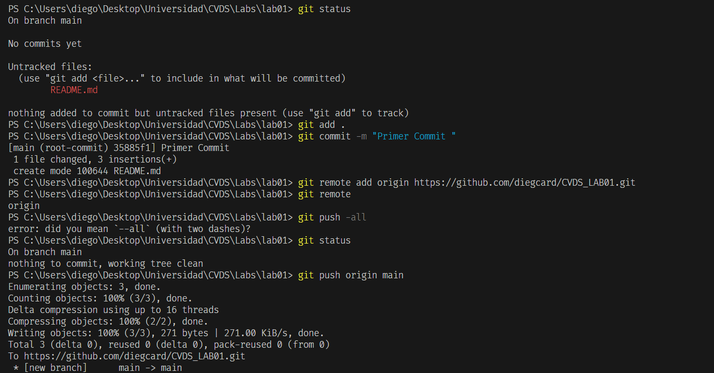
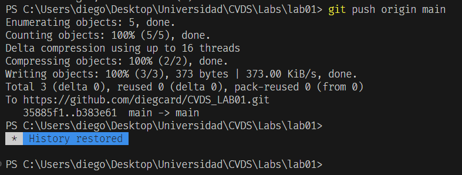
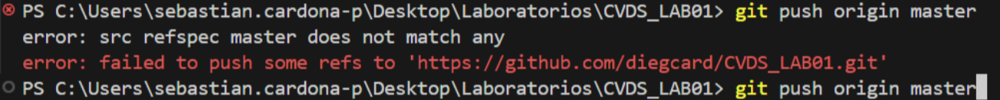
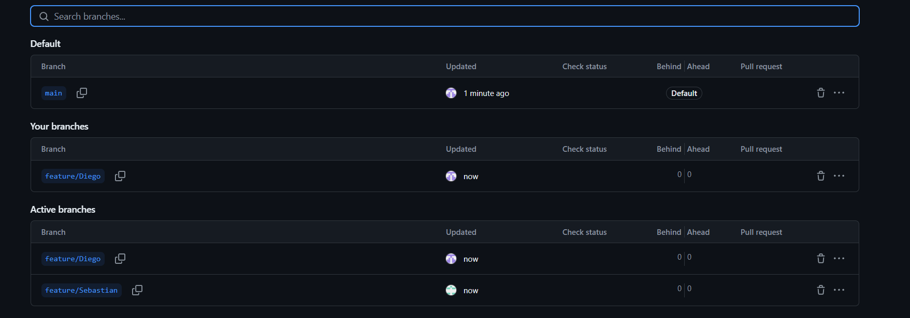

# LABORATORIO 1- INTRODUCCIÓN GIT

## Diego Cardenas
## Sebastian Cardona

Cambio realizado para visualizar en el repositorio

Paso a paso

## Prueba para pull Request Diego

### 3.

git add .
Se usa para madar camnbios locales al area de preparacion.

git commit -m "mensaje"
Este comando se utiliza para confirmar los cambios que están en el área de preparación y guardarlos en el historial del repositorio.

Prueba para subir cambios al mismo tiempo

6.

Lo que sucedio fue que a mi compañero no le dejo subir los cambios, entonces yo gane la carrera 

### 7.

Resolvimos los conflictos haciendo un pull y despues un push.

# Parte tres

### 1.

Esto seria por medio de las ramas en git y los pull request y las solicitudes de los cambios que se quieran subir al repositorio y los aprueben o los rechazen.

### 2.

Un <Strong>Pull Request</Strong> es una petición para que los cambios realizados en una rama sean revisados y, si se aprueban, integrados en otra rama, usualmente la principal como main o master. Este proceso facilita la colaboración en proyectos, permitiendo que otros revisen, comenten y propongan mejoras al código antes de que se incorpore al código base del proyecto.

Se crea la rama que cada uno y despues se ejecutan los cambios

### 3.

### 4.

Cada quien hizo un cambio